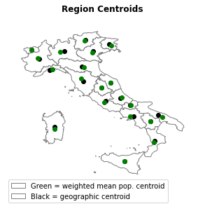

# Population Visualizations Using Python

## Description
The goal of this project is to visualize the population of a country using the populations of smaller units. More specifically, **I use cartograms and weighted population mean centroids to understand where people live in** Italy. To shed light on a particular country, **I use Italian provinces (equivalent to U.S. counties)** for my examples. By using this data, one can better understand where the population centers of Italy are and how they compare to the geographic centers of a given geographic unit. For example, we see in the image below that Apulia has the largest difference between the weighted mean population centroid and the geographic centroid of any region. 

## Data
The data that makes up this project is divided into population/density data and geographic data. The former comes from a [wikipedia table about Italian provinces](https://en.wikipedia.org/wiki/Provinces_of_Italy#List). The latter comes from a [database maintained by NYU](https://geo.nyu.edu/catalog/stanford-mn871sp9778). I corrected slight inconsistencies with the data and then merged the data sources. 

## Process
For both visualization methods, I aggregated the data (106 units) into increasingly larger units: Regions (20), state statistical region2 (5), cultural regions (3), and one for the whole country. The two methods are split into separate notebooks, but follow the same structure.

In each case, some units are shown to be much smaller than others. The regions, for example, show a huge disparity in size: Aosta Valley is 80 times smaller than Lombardia! 

PIC OF CARTOGRAM of region sizes

# Findings
Both visualizations shed light on the differences in population for each unit. I will list some of the notable findings for each level of grouping here:
- **Province**
    - Lazio is clearly the largest region while there are many provinces that are so small as to seem non-existant. Further, clear clusters emerge, especially across the north of the country, roughly from Venice to Turin

- **Region**
    - We can see that Sicily, Lombardy, Lazio, Venice, and Campania are the largest regions, while many others pale in comparison. The largest region, Lombardy, is 80 times larger than the smallest region, Aosta Valley! 
    - Most provinces are evenly distributed in terms of population: Apulia had the largest distance between its geographic centroid and weighted mean population centroid and it is not very noticably different (see first image). 

- **Macroregion**
    - The Macroregion visualizations primarily show that:
        1. Most of the macroregions are roughly similar in terms of population
        2. The Insular region is a huge outlier in terms of population (much smaller), and 
        3. Sicily is much more populated than Sardinia

- **Cultural Region**
    - The cultural region visualizations show that the North is the most populated of the three. Additionally, we see that Central Italy is much smaller than Southern and Northern Italy. In all cases the geographic centroid and population centroid are quite close together. 

- **All of Italy**
    - Somewhat surprisingly, we see that the geographic centroid is nearly identical to the weighted mean population centroid. This shows that neither edge of Italy is heavily skewed in terms of population, despite what the cultural region section might lead one to believe.

## Technologies used
- Jupyter Notebook
- Python 
    - Seaborn
    - Pandas
    - GeoPandas
    - GeoPlot
    - Shapely